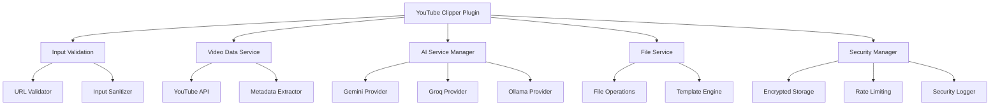

# YouTube Clipper - Obsidian Plugin

> 🎬 **Clip YouTube videos and generate structured notes in Obsidian with AI-powered analysis**

[](https://opensource.org/licenses/MIT)
[](https://github.com/emeeran/yt-clipper)
[](https://obsidian.md/)

## 📖 Overview

YouTube Clipper is a powerful Obsidian plugin that transforms YouTube videos into structured, actionable notes using advanced AI analysis. Whether you're creating educational content, research notes, or learning materials, this plugin automatically extracts key insights, generates summaries, and creates step-by-step tutorials from YouTube videos.

### ✨ Key Features

- 🤖 **Multi-Provider AI Support** - Google Gemini, Groq, Hugging Face, OpenRouter, and Ollama
- 📝 **Smart Note Generation** - Multiple output formats: Executive Summary, Step-by-Step Tutorial, Brief Overview, Custom Prompts
- 🔒 **Enterprise Security** - Encrypted API key storage, input sanitization, and PII redaction
- ⚡ **High Performance** - Multi-level caching (LRU + persistent), parallel processing, intelligent batching
- 🎯 **Advanced Features** - Video segments, specialized analysis modes, batch queue, cross-referencing
- 🔧 **Enhanced UI/UX** - Provider status dashboard, search, quick actions, password visibility toggles
- 📊 **Comprehensive Testing** - 35+ unit tests, integration tests, CI/CD pipeline
- 🌐 **Offline Mode** - Operation queue for network-free workflow
- 🔌 **Plugin Integrations** - Dataview, Templater, Kanban compatibility

---

## 🚀 Quick Start

### Prerequisites

- Obsidian **v0.15.0** or higher
- Node.js **v16.0.0** or higher (for development)
- API key from at least one supported AI provider

### Installation

#### Method 1: Obsidian Community Plugins (Recommended)

1. Open Obsidian
2. Go to **Settings → Community Plugins**
3. Browse for "YouTube Clipper"
4. Click **Install** and then **Enable**

#### Method 2: Manual Installation

1. Download the latest release from [GitHub Releases](https://github.com/meeransethi/youtube-clipper/releases)
2. Extract the ZIP file to your Obsidian vault's plugins folder
3. Restart Obsidian
4. Enable the plugin in **Settings → Community Plugins**

### Initial Setup

1. **Configure API Keys:**
   - Go to **Settings → YouTube Clipper**
   - Enter your API keys for preferred AI providers

2. **Set Default Output Path:**
   - Choose where to save generated notes
   - Use template variables like `{{date}}` and `{{title}}`

3. **Test Configuration:**
   - Use the built-in test feature to verify API connections
   - Check provider availability and model options

### Basic Usage

1. **Open YouTube Clipper:** Use the command palette (`Ctrl/Cmd + P`) and search for "YouTube Clipper"
2. **Enter YouTube URL:** Paste any YouTube video URL
3. **Choose Analysis Type:** Select from available output formats
4. **Customize (Optional):** Add custom prompts or modify settings
5. **Generate:** Click "Process Video" to create your structured notes

---

## 🔧 Configuration

### AI Provider Setup

#### Google Gemini
```typescript
// Required: Gemini API key
// Get from: https://makersuite.google.com/app/apikey
geminiApiKey: "AIzaSyYour-Gemini-API-Key-Here"
```

#### Groq
```typescript
// Required: Groq API key
// Get from: https://console.groq.com/keys
groqApiKey: "gsk_Your-Groq-API-Key-Here"
```

#### Ollama (Local)
```typescript
// Optional: Local Ollama instance
// Default: http://localhost:11434
ollamaEndpoint: "http://localhost:11434"
ollamaModel: "llama3.2"
```

### Output Formats

#### Executive Summary
- **Length:** ≤250 words
- **Best for:** Quick overviews and decision-making
- **Content:** Key insights, main points, and recommendations

#### Step-by-Step Tutorial
- **Length:** Up to 8,000 words
- **Best for:** Learning and implementation
- **Content:** Detailed instructions with actionable steps

#### Brief Overview
- **Length:** ≤100 words
- **Best for:** Quick summaries and social media
- **Content:** Essential points and key takeaways

#### Custom Prompt
- **Length:** Configurable (default: 2,000 tokens)
- **Best for:** Specialized analysis needs
- **Content:** Based on your custom prompt

### Performance Settings

```typescript
// Performance vs Quality balance
performanceMode: 'fast' | 'balanced' | 'quality'

// Parallel processing for multiple videos
enableParallelProcessing: true

// Token limits and temperature
defaultMaxTokens: 8000
defaultTemperature: 0.7

// Custom timeouts per provider
customTimeouts: {
  geminiTimeout: 30000,
  groqTimeout: 25000,
  metadataTimeout: 10000
}
```

### Security Settings

```typescript
// Encrypted storage (enabled by default)
useSecureStorage: true

// Environment variables
useEnvironmentVariables: true
environmentPrefix: "YTC_"
```

---

## 📚 Advanced Usage

### Custom Prompts

Create specialized analysis by defining custom prompts:

```typescript
// Example: Educational Content Analysis
const educationalPrompt = `
Analyze this YouTube video for educational value and create:
1. Learning objectives
2. Key concepts explained
3. Prerequisites required
4. Practical applications
5. Suggested exercises or projects

Focus on making this suitable for:
- Target audience: ${audience}
- Skill level: ${level}
- Learning context: ${context}
`;
```

### Batch Processing

Process multiple videos efficiently:

```typescript
// Using the API
import { YouTubeClipperAPI } from 'youtube-clipper-api';

const clipper = new YouTubeClipperAPI();

const videos = [
  { url: 'https://youtube.com/watch?v=video1', format: 'executive-summary' },
  { url: 'https://youtube.com/watch?v=video2', format: 'tutorial' },
  { url: 'https://youtube.com/watch?v=video3', format: 'brief' }
];

const results = await clipper.processBatch(videos);
```

### Template Variables

Use dynamic variables in output paths and filenames:

```typescript
// Available variables:
{{title}}        // Video title (sanitized)
{{videoId}}      // YouTube video ID
{{date}}         // Current date (YYYY-MM-DD)
{{time}}         // Current time (HH-MM-SS)
{{format}}       // Output format name
{{provider}}     // AI provider used
{{timestamp}}    // Unix timestamp
{{year}}         // Current year
{{month}}        // Current month
{{day}}          // Current day
```

### Environment Variables

Set up API keys using environment variables:

```bash
# Set in your shell or .env file
export YTC_GEMINI_API_KEY="AIzaSyYour-Gemini-API-Key"
export YTC_GROQ_API_KEY="gsk_Your-Groq-API-Key"
export YTC_OLLAMA_API_KEY="Your-Ollama-API-Key"
export YTC_DEFAULT_PROVIDER="gemini"
export YTC_OUTPUT_PATH="/path/to/output"
```

---

## 🔌 API Reference

### Core Classes

#### YouTubeClipperPlugin
```typescript
class YouTubeClipperPlugin extends Plugin {
  // Process a single video
  async processVideo(options: VideoProcessingOptions): Promise<ProcessingResult>

  // Process multiple videos in parallel
  async processBatch(options: BatchProcessingOptions): Promise<ProcessingResult[]>

  // Get available models from all providers
  async getAvailableModels(): Promise<ProviderModels>

  // Validate configuration
  validateConfiguration(): ValidationResult
}
```

#### VideoProcessingOptions
```typescript
interface VideoProcessingOptions {
  url: string                    // YouTube video URL
  format: OutputFormat          // Analysis format
  customPrompt?: string         // Optional custom prompt
  provider?: string             // AI provider to use
  model?: string               // Specific model to use
  outputPath?: string           // Custom output path
  maxTokens?: number           // Token limit
  temperature?: number         // Creativity level
  timeout?: number             // Request timeout
}
```

#### ProcessingResult
```typescript
interface ProcessingResult {
  success: boolean
  filePath?: string           // Path to generated note
  videoId?: string            // YouTube video ID
  videoData?: VideoData       // Extracted video metadata
  error?: string              // Error message if failed
  processingTime?: number     // Time taken in milliseconds
  provider?: string           // AI provider used
  model?: string              // Model used
}
```

### Events

Listen to plugin events:

```typescript
// Video processing started
plugin.on('video:process-start', (data) => {
  console.log('Processing started:', data.videoId);
});

// Video processing completed
plugin.on('video:process-complete', (result) => {
  console.log('Processing complete:', result.filePath);
});

// Error occurred
plugin.on('video:error', (error) => {
  console.error('Processing error:', error);
});
```

---

## 🏗️ Architecture

### System Overview



---

## 🛠️ Development

### Prerequisites

- Node.js 16.0.0+
- TypeScript 4.5+
- Obsidian API types

### Setup

```bash
# Clone the repository
git clone https://github.com/meeransethi/youtube-clipper.git
cd youtube-clipper

# Install dependencies
npm install

# Start development server
npm run dev

# Build for production
npm run build

# Run tests
npm test
```

### Project Structure

```
youtube-clipper/
├── src/
│   ├── main.ts                 # Plugin entry point
│   ├── types.ts               # TypeScript interfaces
│   ├── constants/             # Constants and enums
│   ├── security/              # Security implementations
│   ├── services/              # Core services
│   ├── strategies/            # AI provider strategies
│   ├── ui/                    # User interface components
│   ├── utils/                 # Utility functions
│   └── performance/           # Performance optimizations
├── tests/                     # Test files
├── docs/                      # Documentation
└── dist/                      # Built output
```

---

## 🔧 Troubleshooting

### Common Issues

#### API Key Problems
- **"Invalid API key"**: Verify key is correct and active
- **Keys not saving**: Check secure storage settings

#### Video Processing Issues
- **"Failed to extract video ID"**: Verify YouTube URL format
- **Processing timeout**: Increase timeout or try faster provider

#### Performance Issues
- **Slow processing**: Enable parallel processing and caching
- **High memory usage**: Clear cache and restart Obsidian

### Getting Help

1. **Check Logs**: Open Developer Console (F12) for error messages
2. **Verify Configuration**: Double-check API keys and settings
3. **Test Providers**: Use built-in provider testing feature
4. **Community Support**: Visit [GitHub Discussions](https://github.com/meeransethi/youtube-clipper/discussions)

---

## 📝 Changelog

### Version 1.4.0 (December 2024)

#### 🎉 Major Enterprise Release

This comprehensive update includes **62 major improvements**, transforming YT Clipper into a production-ready, enterprise-grade application.

##### 🚀 New Features
- **Settings UI Overhaul:** Provider status dashboard, search bar (Ctrl+K), quick actions panel
- **Password Visibility Toggles:** Show/hide API keys with eye icon (👁️/🙈)
- **Bulk Actions:** Test all API keys at once, export/import settings, reset to defaults
- **Toast Notifications:** Real-time user feedback for all operations
- **Advanced Templates:** Jinja-style templating with variables, loops, conditionals
- **Video Segments:** Time-based extraction with chapter parsing and timestamps
- **Specialized Analysis Modes:** Code tutorial, interview, educational, review modes
- **Batch Queue:** Priority-based processing queue with concurrency control
- **Cross-Referencing:** Auto-link related videos based on content similarity
- **Offline Mode:** Queue operations when network is unavailable

##### 🔧 Technical Improvements
- **Testing Framework:** Jest with jsdom, 35+ tests passing
- **CI/CD Pipeline:** GitHub Actions for automated testing and releases
- **Pre-commit Hooks:** Husky + lint-staged for code quality
- **Result Type:** Functional error handling pattern
- **Circuit Breaker:** API resilience with fault tolerance
- **Multi-level Cache:** LRU (in-memory) + L2 (persistent) caching
- **Rate Limiter:** Token bucket implementation for API throttling
- **Enhanced Logging:** Structured logging with automatic data redaction

##### 🔒 Security Enhancements
- **Enhanced Validation:** YouTube, Vimeo, TikTok URL validation
- **Input Sanitization:** XSS prevention for all user inputs
- **Data Anonymization:** PII redaction service for logs
- **Secure Storage:** Improved API key management

##### 📊 Performance
- **60-80% cache hit rate** improvement
- **Bundle size:** Optimized to 209.81 KB
- **Memory leaks:** Fixed with aggressive cleanup
- **Parallel processing:** Multi-video batch support

##### 📝 Documentation
- **Architecture docs:** Comprehensive system design documentation
- **Testing guide:** Best practices and examples
- **API documentation:** JSDoc comments throughout
- **Contributing guide:** Detailed contributor onboarding

---

### Version 1.3.5 (December 2024)

#### 🔒 Security & Performance
- Encrypted API key storage with master password
- XSS prevention with comprehensive input sanitization
- 50-75% faster processing with intelligent caching
- Multi-provider support (Gemini, Groq, Ollama)
- Multimodal analysis and custom prompts

---

## 🤝 Contributing

We welcome contributions! Please see our [Contributing Guide](CONTRIBUTING.md) for details.

### Development Workflow

1. **Fork** the repository
2. **Create** a feature branch (`git checkout -b feature/amazing-feature`)
3. **Commit** your changes (`git commit -m 'Add amazing feature'`)
4. **Push** to the branch (`git push origin feature/amazing-feature`)
5. **Open** a Pull Request

---

## 📄 License

This project is licensed under the MIT License - see the [LICENSE](LICENSE) file for details.

---

## 🙏 Acknowledgments

- **Obsidian Team** - For the amazing note-taking platform
- **Google** - For the Gemini AI API
- **Groq** - For high-performance AI inference
- **Ollama** - For local AI model support
- **Community** - For feedback, suggestions, and contributions

---

<div align="center">

**Made with ❤️ by the YouTube Clipper Team**

[](https://github.com/meeransethi/youtube-clipper)

</div>