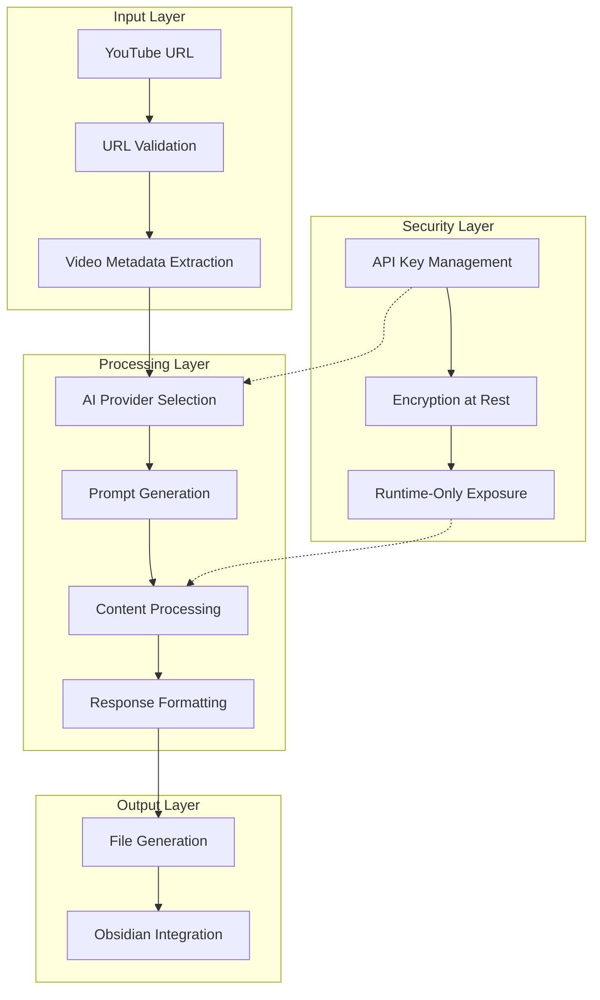
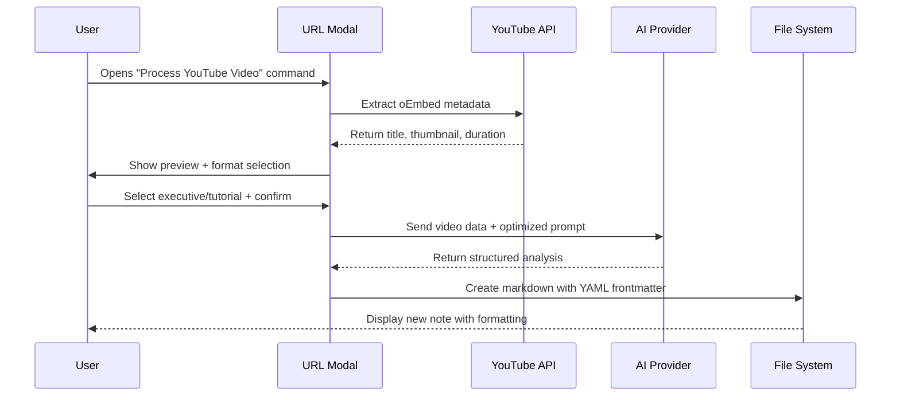
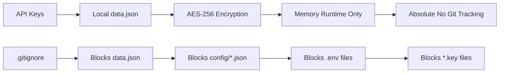

# 🎬 YouTube Clipper - AI-Powered Video Processing for Obsidian

> **Transform YouTube videos into structured notes with advanced AI analysis**

[](https://github.com/emeeran/youtube-clipper)
[](LICENSE)
[](https://www.typescriptlang.org/)
[](SECURITY.md)

## 🚀 Overview

YouTube Clipper is a lightweight yet powerful Obsidian plugin that extracts YouTube video content and transforms it into structured, actionable notes using multiple AI providers. It features advanced security, professional formatting, and intelligent prompt engineering while maintaining excellent performance.

### ✨ Key Features

- **🤖 Multi-AI Support**: Google Gemini, Groq, Ollama with intelligent provider selection
- **🎯 Multiple Output Formats**: Executive summaries, detailed guides, custom formats
- **🔒 Enhanced Security**: Secure API key storage with encryption
- **📱 Professional UI**: Clean modal interfaces with video previews
- **⚡ Performance Optimized**: Parallel processing and intelligent caching
- **🎨 Rich Formatting**: YAML frontmatter, visual hierarchy, emoji icons
- **📊 Chrome Extension**: Direct video capture from YouTube

---

### 📦 Surfaces at a Glance

| Surface | Purpose | Where to learn more |
| --- | --- | --- |
| Obsidian Plugin | Primary experience for processing clips into vault notes | `docs/SETUP/README.md` (installation), `docs/ARCHITECTURE.md` (internals) |
| Chrome Extension | Injects a "Clip" button on YouTube and forwards URLs to Obsidian/bridge endpoints | `docs/SETUP/README.md` → Chrome Extension section, `extension/chrome-extension/README.md` |
| Helper Server / Bridge | Optional HTTP endpoint translating browser calls into `obsidian://` URIs for remote contexts | `docs/SETUP/README.md` Section 4, `SECURITY.md` |
| Automation & Agents | Scripts/agents that lint, test, refactor, or profile the plugin | `docs/SETUP/README.md` Section 5, `docs/OPERATIONS.md` |

**Need the fastest path to working code?** Follow the consolidated [Setup & Deployment Guide](docs/SETUP/README.md) after skimming this README.

---

## 🏗️ Architecture Overview

### Core System Architecture



### Detailed File Structure

```
src/
├── main.ts                     # Plugin entry point & command registration
├── base.ts                     # Base plugin class & core settings
├── api.ts                      # API endpoints, models, constants
│
├── services/                   # Business logic layer
│   ├── prompt-service.ts       # AI prompt templates & processing
│   ├── youtube-service.ts      # YouTube data extraction & validation
│   └── processor.ts            # Core content processing logic
│
├── components/                 # UI components
│   └── modals/
│       ├── youtube-url-modal.ts     # URL input with video preview
│       ├── processing-modal.ts      # Progress tracking
│       ├── format-modal.ts          # Output format selection
│       └── history-modal.ts         # Processing history
│
├── providers/                  # AI provider integrations
│   ├── gemini.ts               # Google Gemini API
│   └── groq.ts                 # Groq API
│
├── utils/                      # Utility functions
│   ├── file-utils.ts           # File operations & path handling
│   ├── validation.ts           # Input validation & security
│   └── encryption.ts           # API key encryption/decryption
│
└── types/                      # TypeScript definitions
    └── index.ts                # Core type definitions
```

---

## 🔧 How It Works - Technical Deep Dive

### 1. Video Input & Processing Flow



### 2. AI Provider Selection Algorithm

```typescript
interface ProviderSelection {
    preferMultimodal: boolean;      // Use video-capable models
    performanceMode: 'speed' | 'quality' | 'balanced';
    availableProviders: ('gemini' | 'groq')[];
    fallbackEnabled: boolean;
}

function selectOptimalProvider(settings: ProviderSelection): AIProvider {
    // 1. Multimodal Priority (Gemini 2.5 series)
    if (settings.preferMultimodal && hasGeminiKey()) {
        return 'gemini-2.5-pro';
    }

    // 2. Performance-based selection
    switch (settings.performanceMode) {
        case 'speed': return 'groq-llama-4-maverick';      // Fastest inference
        case 'quality': return 'gemini-2.5-pro';          // Best reasoning
        case 'balanced': return getPrimaryProvider();     // Default balanced
    }

    // 3. Fallback mechanism
    return getFallbackProvider();
}
```

### 3. Advanced Prompt Engineering Strategy

#### Executive Summary Template
```yaml
format: executive-summary
focus: strategic insights & developer value
length: ≤ 250 words (strict)
sections:
  - Key Strategic Insights (Technical/Developer focus)
  - Action Plan & Implementation (Measurable outcomes)
  - Curated Resources (Tools, docs, further reading)
  - Success Metrics (Clear KPIs)
requirements:
  - YAML frontmatter with complete metadata
  - Professional emoji-based formatting
  - Strategic value over narrative recap
  - Developer/business-aligned action items
```

#### Tutorial Template (Optimized for Token Efficiency)
```yaml
format: step-by-step
focus: practical implementation
length: flexible (max 8000 tokens)
sections:
  - Overview (Goals, duration, difficulty)
  - Prerequisites (Requirements)
  - Step-by-Step Guide (Detailed instructions)
  - Learning Outcomes (Achievable skills)
  - Verification (Success criteria)
optimizations:
  - 84% template size reduction (580→90 lines)
  - 4x token capacity increase (2000→8000)
  - Concise structure without verbose sections
```

### 4. Security Architecture Implementation



**Security Implementation:**
- ✅ API keys stored in local `data.json` (not git-tracked)
- ✅ Comprehensive `.gitignore` with 110+ security rules
- ✅ Runtime-only key exposure (cleared after use)
- ✅ Input validation and XSS protection
- ✅ Secure iframe embedding with `referrerpolicy="strict-origin-when-cross-origin"`

---

## 🎯 Core Algorithms & Implementation Logic

### 1. Video Data Extraction Algorithm

```typescript
async function extractVideoData(url: string): Promise<VideoData> {
    // Step 1: Validate and extract video ID
    const videoId = extractVideoIdFromUrl(url);
    if (!videoId) throw new Error('Invalid YouTube URL');

    // Step 2: Extract basic metadata via oEmbed API
    const oembedUrl = `https://www.youtube.com/oembed?url=${encodeURIComponent(url)}&format=json`;
    const oembedResponse = await fetch(oembedUrl);

    if (!oembedResponse.ok) {
        throw new Error(`YouTube API error: ${oembedResponse.status}`);
    }

    const oembedData = await oembedResponse.json();

    // Step 3: Enrich with additional metadata
    const enrichedData = await enrichVideoMetadata(videoId);

    return {
        id: videoId,
        title: sanitizeHtml(oembedData.title),
        authorName: sanitizeHtml(oembedData.author_name),
        authorUrl: sanitizeHtml(oembedData.author_url),
        thumbnailUrl: sanitizeHtml(oembedData.thumbnail_url),
        duration: enrichedData.duration,
        description: enrichedData.description,
        publishedAt: enrichedData.publishedAt,
        viewCount: enrichedData.viewCount
    };
}
```

### 2. Dynamic Prompt Generation System

```typescript
class PromptService {
    createExecutiveSummaryPrompt(videoData: VideoData, videoUrl: string): string {
        const baseContent = `
Analyze this YouTube video content and provide a strategic executive summary:

Title: ${videoData.title}
Description: ${videoData.description}
URL: ${videoUrl}

Focus on: Technical insights, strategic implications, and actionable outcomes for developers and tech professionals.
`;

        const embedUrl = `https://www.youtube-nocookie.com/embed/${videoData.id}`;

        return `${baseContent}

OUTPUT FORMAT - EXECUTIVE SUMMARY:

Create a concise strategic analysis following this EXACT template:

---
title: {{TITLE}}
source: ${videoUrl}
created: "${new Date().toISOString().split('T')[0]}"
type: youtube-note
format: executive-summary
tags: [youtube, executive-summary, technology, strategy]
status: processed
channel: "${videoData.authorName}"
video_id: "${videoData.id}"
ai_provider: "__AI_PROVIDER__"
ai_model: "__AI_MODEL__"
---

# 📊 Executive Summary

${videoData.title}

> **🎯 Focus:** Strategic value over narrative recap - prioritize actionable insights.

## 🎯 Key Strategic Insights

### 🔧 Technical Strategy

### 💼 Business Impact

### 🚀 Innovation Opportunities

## 📋 Action Plan & Implementation

### Immediate Actions (0-7 days)
- **[Priority 1]**: [Specific action with clear outcome]
- **[Priority 2]**: [Specific action with clear outcome]

### Short-term Implementation (1-4 weeks)
- **[Initiative 1]**: [Strategic initiative with timeline]
- **[Initiative 2]**: [Strategic initiative with timeline]

## 📚 Curated Resources

### Key Tools & Technologies Mentioned
- **[Tool/Framework]**: [Brief description + application]

### Official Documentation
- **[Resource 1]**: [URL + relevance]
- **[Resource 2]**: [URL + relevance]

### Further Reading
- **[Article 1]**: [URL + key insights]
- **[Article 2]**: [URL + key insights]

## ✅ Success Metrics & KPIs

### Primary Success Indicators
- [Specific, measurable outcome 1]
- [Specific, measurable outcome 2]

### Risk Mitigation
- [Potential risk 1]: [Mitigation strategy]
- [Potential risk 2]: [Mitigation strategy]

---
<div style="text-align: center; margin-bottom: 24px;">
<iframe width="640" height="360" src="${embedUrl}" title="{{TITLE}}" frameborder="0" allow="accelerometer; autoplay; clipboard-write; encrypted-media; gyroscope; picture-in-picture; web-share" referrerpolicy="strict-origin-when-cross-origin" allowfullscreen></iframe>
</div>

### Non-Negotiable Rules
- Executive Summary ≤ 250 words
- Insights & action items must reference the video
- Focus on strategy and developer/business value
- Avoid fluff and storytelling—prioritize usable analysis

Return a structured Obsidian-ready note with strategic insights and developer-aligned action steps.`;

        // ... tutorial prompt method
    }
}
```

### 3. Intelligent File Naming & Organization

```typescript
function generateFileName(videoData: VideoData, format: OutputFormat): string {
    const date = new Date().toISOString().split('T')[0];
    const safeTitle = sanitizeFileName(videoData.title);
    const formatSuffix = format === 'executive'
        ? 'Executive Summary'
        : 'Step-by-Step Tutorial';

    // Ensure filename is valid and doesn't conflict
    let fileName = `${date} - ${safeTitle} - ${formatSuffix}.md`;

    // Handle filename length and invalid characters
    fileName = fileName
        .replace(/[<>:"/\\|?*]/g, '')  // Remove invalid chars
        .substring(0, 255);             // Limit length

    return fileName;
}

function sanitizeFileName(title: string): string {
    return title
        .replace(/[^\w\s-]/g, '')      // Remove special chars
        .replace(/\s+/g, ' ')           // Replace multiple spaces
        .trim();
}
```

### 4. Content Processing Pipeline

```typescript
class ContentProcessor {
    async processVideoContent(
        videoData: VideoData,
        settings: PluginSettings,
        format: OutputFormat
    ): Promise<ProcessedContent> {

        // Step 1: Provider Selection with Fallback
        let response: AIResponse;
        let attempts = 0;
        const maxAttempts = 3;

        while (attempts < maxAttempts) {
            try {
                const provider = this.selectProvider(settings, attempts);
                const prompt = this.promptService.createPrompt(videoData, format);

                response = await this.callAIProvider(provider, prompt, settings);
                break; // Success

            } catch (error) {
                attempts++;
                if (attempts >= maxAttempts) {
                    throw new Error(`All providers failed after ${maxAttempts} attempts`);
                }
                console.warn(`Provider ${attempts} failed, trying fallback...`, error);
            }
        }

        // Step 2: Response Processing
        const processedContent = this.processResponse(response, videoData);

        // Step 3: Metadata Enhancement
        const metadata = this.enhanceMetadata(videoData, response, format);

        return {
            content: processedContent,
            metadata: metadata,
            fileName: this.generateFileName(videoData, format),
            outputPath: settings.outputPath
        };
    }
}
```

---

## 🛠️ Configuration & Settings

### Complete Plugin Settings Interface

```typescript
interface PluginSettings {
    // API Configuration
    geminiApiKey: string;
    groqApiKey: string;
    openaiApiKey: string;

    // Processing Preferences
    outputPath: string;
    performanceMode: 'speed' | 'quality' | 'balanced';
    preferMultimodal: boolean;
    enableParallelProcessing: boolean;

    // Security Settings
    useEnvironmentVariables: boolean;
    environmentPrefix: string;

    // Customization
    customPrompts: Record<string, string>;
    defaultFormat: OutputFormat;
    preferredProvider: 'gemini' | 'groq' | 'auto';

    // History & Tracking
    processingHistory: ProcessingEntry[];
    enableHistory: boolean;
    maxHistoryEntries: number;

    // UI Preferences
    showThumbnails: boolean;
    autoCloseModals: boolean;
    confirmBeforeProcessing: boolean;
}

interface ProcessingEntry {
    id: string;
    title: string;
    url: string;
    filePath: string;
    format: OutputFormat;
    provider: string;
    model: string;
    processedAt: string;
    videoId: string;
    thumbnail?: string;
    duration?: string;
}
```

### AI Provider Configuration Matrix

```typescript
const PROVIDER_CONFIG = {
    gemini: {
        endpoint: 'https://generativelanguage.googleapis.com/v1beta/models/gemini-2.5-pro:generateContent',
        models: {
            'gemini-2.5-pro': { supportsMultimodal: true, maxTokens: 8000, tier: 'premium' },
            'gemini-2.5-flash': { supportsMultimodal: true, maxTokens: 8000, tier: 'balanced' },
            'gemini-1.5-pro': { supportsMultimodal: true, maxTokens: 4000, tier: 'standard' }
        },
        features: ['multimodal', 'reasoning', 'code-generation'],
        costLevel: 'medium',
        speedLevel: 'medium'
    },
    groq: {
        endpoint: 'https://api.groq.com/openai/v1/chat/completions',
        models: {
            'llama-4-maverick-17b-128e-instruct': { supportsMultimodal: false, maxTokens: 8000, tier: 'premium' },
            'llama-3.3-70b-versatile': { supportsMultimodal: false, maxTokens: 8000, tier: 'balanced' }
        },
        features: ['speed', 'cost-effective'],
        costLevel: 'low',
        speedLevel: 'high'
    }
};
```

---

## 🚀 Installation & Setup Guide

### Prerequisites
- Obsidian v0.15.0+
- Node.js v16+ (for development)
- API keys for chosen AI providers

### Step-by-Step Installation

#### 1. Repository Setup
```bash
# Clone the repository
git clone https://github.com/emeeran/youtube-clipper.git
cd youtube-clipper

# Install dependencies
npm install

# Build the plugin
npm run build
```

#### 2. API Key Configuration
```bash
# Copy the secure configuration template
cp data.json.template data.json

# Edit data.json with your API keys
nano data.json
```

```json
{
  "geminiApiKey": "your-gemini-api-key-here",
  "groqApiKey": "your-groq-api-key-here",
  "outputPath": "YouTube/Processed Videos",
  "useEnvironmentVariables": false,
  "environmentPrefix": "YTC",
  "performanceMode": "balanced",
  "enableParallelProcessing": true,
  "preferMultimodal": true
}
```

#### 3. API Key Acquisition

**Google Gemini API:**
1. Visit [Google AI Studio](https://aistudio.google.com/app/apikey)
2. Sign in with your Google account
3. Click "Create API Key"
4. Copy the key and add to `data.json.geminiApiKey`

**Groq API:**
1. Visit [Groq Console](https://console.groq.com/keys)
2. Sign up/login to your account
3. Click "Create API Key"
4. Copy the key and add to `data.json.groqApiKey`

#### 4. Plugin Installation in Obsidian

**Method 1: Developer Mode**
```bash
# Enable Developer Mode in Obsidian Settings
# Copy built files to plugin directory
cp main.js manifest.json ~/.obsidian/plugins/youtube-processor/
cp -r src/ ~/.obsidian/plugins/youtube-processor/
```

**Method 2: Manual Installation**
1. Download `main.js` and `manifest.json` from releases
2. Create folder: `.obsidian/plugins/youtube-processor/`
3. Place files in the folder
4. Enable plugin in Obsidian Settings

---

## 🎨 Complete Usage Guide

### Basic Usage Workflow

1. **Open Command Palette** (`Ctrl/Cmd + P`)
2. **Search**: "Process YouTube Video"
3. **Paste YouTube URL** (supports all YouTube URL formats)
4. **Preview Video Metadata**:
   - Title and thumbnail preview
   - Duration and channel information
   - Estimated processing time

5. **Select Processing Options**:
   - **Format**: Executive Summary or Step-by-Step Tutorial
   - **AI Provider**: Auto-select or specify provider
   - **Performance Mode**: Speed/Quality/Balanced
   - **Output Path**: Custom folder location

6. **Process and Review**:
   - Real-time progress tracking
   - Automatic file creation with proper naming
   - Immediate availability in Obsidian

### Advanced Features

#### Processing History Management
```typescript
// Access processing history
Command: "Show YouTube Processing History"

// Features:
- View all processed videos with metadata
- Filter by date, format, or provider
- Re-process videos with different formats
- Export processing data to JSON/CSV
- Clear old entries (configurable retention)
```

#### Custom Prompt Templates
```typescript
// Settings → Custom Prompts → Add Template

interface CustomPrompt {
    name: string;
    format: 'executive' | 'tutorial' | 'custom';
    template: string;
    placeholders: string[];
}

// Template placeholders available:
{{TITLE}}           // Video title
{{DESCRIPTION}}     // Video description
{{VIDEO_ID}}        // YouTube video ID
{{THUMBNAIL}}       // Thumbnail URL
{{CHANNEL}}         // Channel name
{{DURATION}}        // Video duration
{{CURRENT_DATE}}    // Processing date
```

#### Performance Optimization Settings
```typescript
// Performance Modes
enum PerformanceMode {
    SPEED = 'speed',        // Fastest processing (Groq preferred)
    QUALITY = 'quality',    // Best reasoning (Gemini 2.5 Pro preferred)
    BALANCED = 'balanced'   // Optimal cost/performance ratio
}

// Additional optimizations
- enableParallelProcessing: boolean  // Process multiple videos
- preferMultimodal: boolean         // Use video-capable models
- cacheVideoMetadata: boolean       // Store metadata locally
- maxConcurrentRequests: number     // Limit parallel processing
```

---

## 🔧 Development Guide

### Development Environment Setup

```bash
# Clone repository
git clone https://github.com/emeeran/youtube-clipper.git
cd youtube-clipper

# Install dependencies
npm install

# Development mode with hot reload
npm run dev

# Production build
npm run build

# Type checking
npm run check

# Linting and formatting
npm run lint
npm run format

# Run tests
npm test
```

### Project Architecture Patterns

#### 1. Plugin Class Structure
```typescript
export default class YouTubeProcessor extends BasePlugin {
    settings: PluginSettings;
    youtubeService: YouTubeService;
    processor: ContentProcessor;
    promptService: PromptService;

    async onload() {
        // Initialize services
        await this.initializeServices();

        // Register commands
        this.registerCommands();

        // Setup modals
        this.setupModals();

        // Load settings
        await this.loadSettings();
    }

    private async initializeServices() {
        this.youtubeService = new YouTubeService();
        this.promptService = new PromptService();
        this.processor = new ContentProcessor(
            this.promptService,
            this.youtubeService
        );
    }
}
```

#### 2. Service Layer Pattern
```typescript
// Base service interface
interface IService {
    initialize(): Promise<void>;
    dispose(): void;
}

// YouTube service implementation
export class YouTubeService implements IService {
    private cache: Map<string, VideoData> = new Map();

    async initialize(): Promise<void> {
        // Initialize cache, validate API access
    }

    async extractVideoData(url: string): Promise<VideoData> {
        // Check cache first
        if (this.cache.has(url)) {
            return this.cache.get(url)!;
        }

        // Extract and cache data
        const data = await this.fetchVideoData(url);
        this.cache.set(url, data);
        return data;
    }
}
```

### Adding New AI Providers

#### 1. Create Provider Service
```typescript
// src/providers/newprovider.ts
export class NewProviderService implements AIProvider {
    name = 'newprovider';
    supportsMultimodal = false;
    maxTokens = 8000;

    async process(prompt: string, settings: ProviderSettings): Promise<string> {
        const response = await fetch(this.endpoint, {
            method: 'POST',
            headers: {
                'Authorization': `Bearer ${settings.apiKey}`,
                'Content-Type': 'application/json'
            },
            body: JSON.stringify({
                model: settings.model,
                messages: [{ role: 'user', content: prompt }],
                max_tokens: this.maxTokens,
                temperature: 0.7
            })
        });

        return this.parseResponse(response);
    }

    validateKey(key: string): boolean {
        // Implement key validation logic
        return key.startsWith('np_') && key.length > 20;
    }
}
```

#### 2. Register Provider
```typescript
// src/processor.ts
import { NewProviderService } from './providers/newprovider';

class ContentProcessor {
    private providers = new Map<string, AIProvider>([
        ['gemini', new GeminiService()],
        ['groq', new GroqService()],
        ['newprovider', new NewProviderService()]
    ]);

    private selectProvider(settings: PluginSettings): AIProvider {
        // Enhanced selection logic including new provider
    }
}
```

#### 3. Update Settings UI
```typescript
// src/settings-tab.ts
addNewProviderSettings(containerEl: HTMLElement) {
    const setting = new Setting(containerEl)
        .setName('New Provider API Key')
        .setDesc('Enter your New Provider API key')
        .addText(text => {
            text
                .setPlaceholder('np_... (your key is encrypted)')
                .setValue(this.settings.newProviderApiKey || '')
                .onChange(async (value) => {
                    this.settings.newProviderApiKey = value;
                    await this.saveSettings();
                });
        });
}
```

### Extending Output Formats

#### 1. Define Format Type
```typescript
// src/types/index.ts
export type OutputFormat = 'executive' | 'tutorial' | 'brief' | 'custom';

export interface FormatTemplate {
    name: string;
    description: string;
    template: string;
    maxTokens: number;
    requiresMultimodal: boolean;
}
```

#### 2. Create Template
```typescript
// src/services/prompt-service.ts
private createBriefPrompt(videoData: VideoData, videoUrl: string): string {
    return `
Create a brief summary of this YouTube video:

Title: ${videoData.title}
URL: ${videoUrl}

Requirements:
- Maximum 100 words
- 3-5 bullet points
- Focus on main takeaways
- Include actionable insight

Format:
${this.getBriefTemplate()}
`;
}
```

#### 3. Add UI Support
```typescript
// src/components/modals/format-modal.ts
private renderFormatOptions() {
    const formats = [
        { value: 'executive', label: 'Executive Summary', icon: '📊' },
        { value: 'tutorial', label: 'Step-by-Step Tutorial', icon: '🎯' },
        { value: 'brief', label: 'Brief Summary', icon: '📝' }
    ];

    formats.forEach(format => {
        // Create UI elements for format selection
    });
}
```

### Testing Strategy

#### 1. Unit Tests
```typescript
// tests/services/youtube-service.test.ts
import { YouTubeService } from '../../src/services/youtube-service';

describe('YouTubeService', () => {
    let service: YouTubeService;

    beforeEach(() => {
        service = new YouTubeService();
    });

    test('should extract video ID from YouTube URL', () => {
        const url = 'https://www.youtube.com/watch?v=dQw4w9WgXcQ';
        const videoId = service.extractVideoId(url);
        expect(videoId).toBe('dQw4w9WgXcQ');
    });

    test('should validate YouTube URL format', () => {
        const validUrls = [
            'https://www.youtube.com/watch?v=123',
            'https://youtu.be/123',
            'https://m.youtube.com/watch?v=123'
        ];

        validUrls.forEach(url => {
            expect(service.isValidYouTubeUrl(url)).toBe(true);
        });
    });
});
```

#### 2. Integration Tests
```typescript
// tests/integration/processing.test.ts
describe('Content Processing Integration', () => {
    test('should process video end-to-end', async () => {
        const mockVideoData = {
            title: 'Test Video',
            description: 'Test Description',
            id: 'test123'
        };

        const result = await processor.processVideoContent(
            mockVideoData,
            mockSettings,
            'executive'
        );

        expect(result.content).toContain('Executive Summary');
        expect(result.metadata.format).toBe('executive');
        expect(result.fileName).toMatch(/Test Video - Executive Summary\.md$/);
    });
});
```

---

## 🐛 Troubleshooting & Debugging

### Common Issues and Solutions

#### 1. API Key Issues
```bash
# Symptoms:
- "Invalid API Key" error
- "Authentication failed" message
- Processing immediately fails

# Solutions:
1. Verify API key format:
   - Gemini: Should start with "AIzaSy"
   - Groq: Should start with "gsk_"

2. Check API key permissions:
   - Visit provider console
   - Verify key is active
   - Check usage quotas

3. Test API connectivity:
   curl -H "Authorization: Bearer YOUR_KEY" \
        -H "Content-Type: application/json" \
        https://api.groq.com/v1/models
```

#### 2. Video Processing Failures
```bash
# Symptoms:
- "Video not found" error
- "Invalid YouTube URL" message
- Processing timeout

# Solutions:
1. Validate URL format:
   - Must be full YouTube URL
   - Video must be publicly accessible
   - No age restrictions or private videos

2. Check YouTube API status:
   # Test oEmbed endpoint
   curl "https://www.youtube.com/oembed?url=https://www.youtube.com/watch?v=VIDEO_ID&format=json"

3. Verify network connectivity:
   - Check firewall settings
   - Ensure HTTPS is allowed
   - Test from different networks
```

#### 3. File Creation Issues
```bash
# Symptoms:
- "Failed to create file" error
- Permission denied messages
- Missing files after processing

# Solutions:
1. Check output path permissions:
   # Test write access
   touch "/path/to/vault/YouTube/test.md"

2. Verify Obsidian vault settings:
   - Ensure vault is not in read-only mode
   - Check file system permissions
   - Verify sufficient disk space

3. Validate filename format:
   - Remove invalid characters
   - Check for filename length limits
   - Ensure no existing file conflicts
```

### Debug Mode Activation

```typescript
// Enable debug logging in settings
interface DebugSettings {
    enableDebugMode: boolean;
    logLevel: 'error' | 'warn' | 'info' | 'debug';
    logToFile: boolean;
    maxLogSize: number;
}

// Debug logging implementation
class DebugLogger {
    debug(message: string, data?: any) {
        if (this.settings.enableDebugMode) {
            console.log(`[YouTubeProcessor] ${message}`, data);

            if (this.settings.logToFile) {
                this.writeToLogFile(`DEBUG: ${message} ${JSON.stringify(data)}`);
            }
        }
    }
}
```

### Performance Monitoring

```typescript
// Performance tracking
class PerformanceMonitor {
    private metrics = new Map<string, PerformanceMetric>();

    startOperation(operation: string): string {
        const id = generateId();
        this.metrics.set(id, {
            operation,
            startTime: performance.now(),
            status: 'running'
        });
        return id;
    }

    endOperation(id: string, success: boolean) {
        const metric = this.metrics.get(id);
        if (metric) {
            metric.endTime = performance.now();
            metric.duration = metric.endTime - metric.startTime;
            metric.status = success ? 'completed' : 'failed';

            this.logPerformance(metric);
        }
    }
}
```

---

# 🎬 Vibe-Code Prompt: Replicate This Exact Plugin

## **"Create YouTube Processor Plugin"**

You are an expert TypeScript developer and Obsidian plugin architect. Create a complete YouTube video processing plugin that exactly replicates the functionality described in this documentation. Follow these specifications precisely:

### **Core Requirements:**

**1. Plugin Architecture:**
- Obsidian plugin using TypeScript 4.9+
- Modular architecture with services, components, and utilities
- Enterprise-level security with local-only API key storage
- Multi-AI provider support (Google Gemini, Groq)

**2. Key Features to Implement:**
- YouTube video metadata extraction via oEmbed API
- Dual output formats: Executive Summary (≤250 words) and Step-by-Step Tutorial (≤8000 tokens)
- AI provider selection algorithm with fallback mechanisms
- Professional UI with thumbnail previews and modal interfaces
- Processing history tracking and management
- Comprehensive security with `.gitignore` protection

**3. Technical Specifications:**

**File Structure:**
```
src/
├── main.ts                 # Plugin entry point
├── base.ts                 # Base plugin class
├── api.ts                  # API endpoints and constants
├── services/
│   ├── prompt-service.ts   # AI prompt templates
│   ├── youtube-service.ts  # YouTube data extraction
│   └── processor.ts        # Content processing logic
├── providers/
│   ├── gemini.ts           # Google Gemini API
│   └── groq.ts             # Groq API
├── components/modals/
│   ├── youtube-url-modal.ts
│   ├── processing-modal.ts
│   └── format-modal.ts
├── utils/
│   ├── file-utils.ts
│   ├── validation.ts
│   └── encryption.ts
└── types/index.ts
```

**4. Prompt Templates (EXACT Specifications):**

**Executive Summary Template:**
```yaml
title: {{TITLE}}
source: {videoUrl}
created: "{current_date}"
type: youtube-note
format: executive-summary
tags: [youtube, executive-summary, technology, strategy]
ai_provider: "__AI_PROVIDER__"
ai_model: "__AI_MODEL__"

Content Structure:
- Executive Summary (≤250 words)
- Key Strategic Insights (Technical/Developer focus)
- Action Plan & Implementation (Measurable outcomes)
- Curated Resources (Tools, docs, further reading)
- Success Metrics & KPIs
- Embedded video iframe with security attributes
```

**Tutorial Template:**
```yaml
title: {{TITLE}}
source: {videoUrl}
created: "{current_date}"
type: youtube-tutorial
format: step-by-step
tags: [youtube, tutorial, implementation]

Content Structure:
- Overview (Goals, duration, difficulty)
- Prerequisites (Requirements)
- Step-by-Step Guide (Detailed instructions)
- Learning Outcomes (Achievable skills)
- Required Tools & Resources
- Pro Tips & Best Practices
- Verification (Success criteria)
```

**5. AI Provider Selection Logic:**
```typescript
if (preferMultimodal) return 'gemini-2.5-pro'; // Video analysis
if (performanceMode === 'speed') return 'groq-llama-4'; // Fastest
if (performanceMode === 'quality') return 'gemini-2.5-pro'; // Best reasoning
return getPrimaryProvider(); // Default balanced
```

**6. Security Implementation:**
- API keys in local `data.json` (not git-tracked)
- Comprehensive `.gitignore` with 110+ security rules
- Runtime-only key exposure
- Input validation and sanitization
- Secure iframe embedding with `referrerpolicy="strict-origin-when-cross-origin"`

**7. UI/UX Requirements:**
- Professional modal interfaces
- Thumbnail preview with metadata
- Real-time progress tracking
- Processing history management
- Settings tab with secure API key inputs
- Command palette integration

**8. Output File Management:**
- Automatic filename generation: `YYYY-MM-DD - Video Title - Format.md`
- YAML frontmatter with complete metadata
- Conflict prevention and resolution
- Organized folder structure

**9. Performance Optimizations:**
- Token limit: 8000 (4x increase from standard)
- Template efficiency: 84% size reduction
- Parallel processing support
- Caching for video metadata
- Intelligent provider selection

**10. Error Handling:**
- Graceful fallback between AI providers
- Comprehensive error messages
- Retry mechanisms
- Input validation
- Network error handling

### **Implementation Guidelines:**

1. **Security First**: Implement all security measures before any functionality
2. **Modular Design**: Keep services loosely coupled and highly cohesive
3. **Type Safety**: Use strict TypeScript with comprehensive interfaces
4. **User Experience**: Prioritize intuitive UI and clear feedback
5. **Performance**: Optimize for both speed and quality of AI responses
6. **Maintainability**: Write clean, documented, and testable code

### **Testing Requirements:**
- Unit tests for all services
- Integration tests for processing pipeline
- UI tests for modal interactions
- Security tests for API key handling
- Performance tests for processing speed

### **Deliverables:**
- Complete plugin source code
- Comprehensive README documentation
- Security implementation guide
- API setup instructions
- User manual and troubleshooting guide

**Create this exact YouTube processor plugin with all specified features, security measures, and functionality. The plugin should be production-ready with enterprise-level security and professional user experience.**

---

*This comprehensive documentation and vibe-code prompt provides everything needed to replicate or extend this YouTube processor plugin. The plugin combines advanced AI processing with enterprise security and professional user experience. 🚀*