# YT-Clipper Architecture Diagrams

## System Architecture Overview

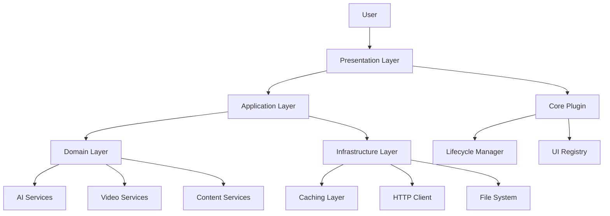

## 5-Stage Pipeline Architecture

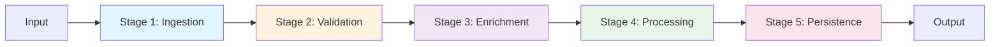

## Pipeline Stage Details

### Stage 1: Ingestion
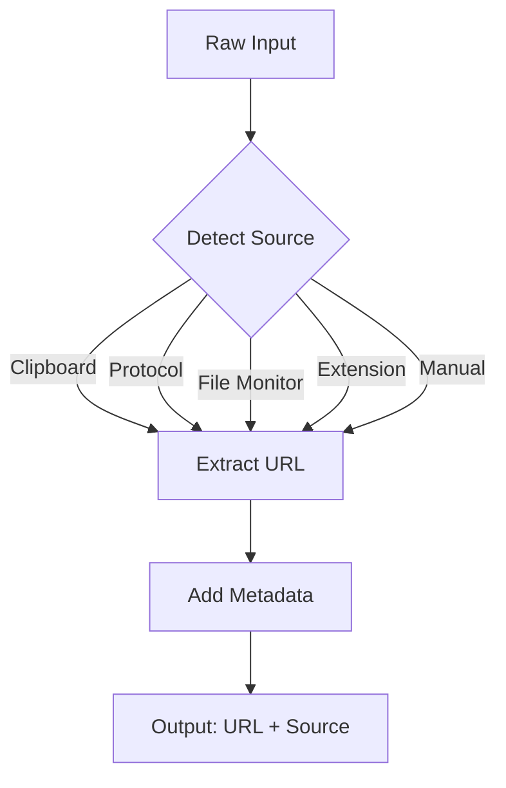

### Stage 2: Validation
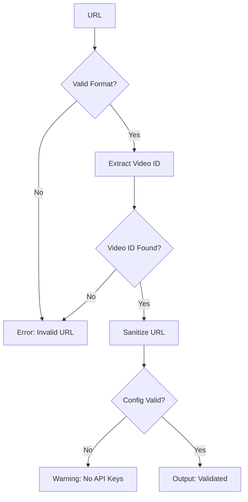

### Stage 3: Enrichment
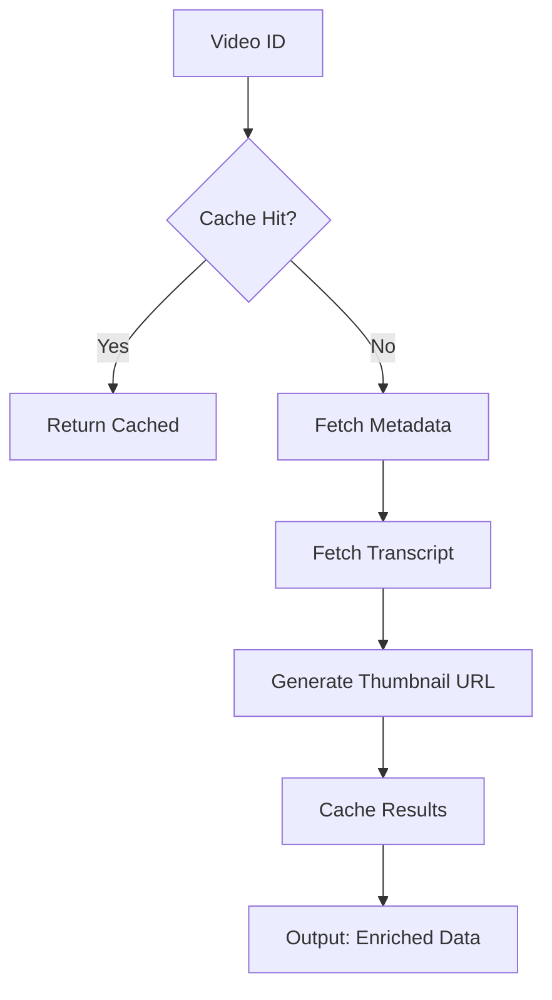

### Stage 4: Processing
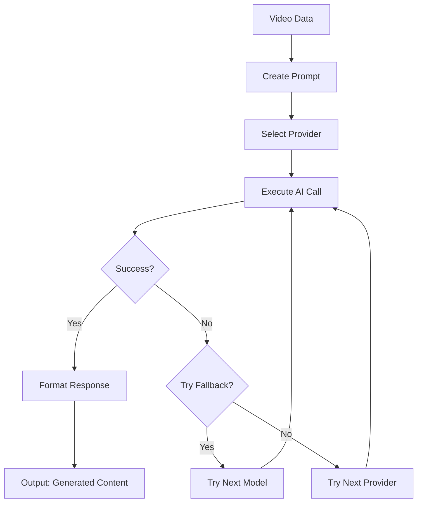

### Stage 5: Persistence
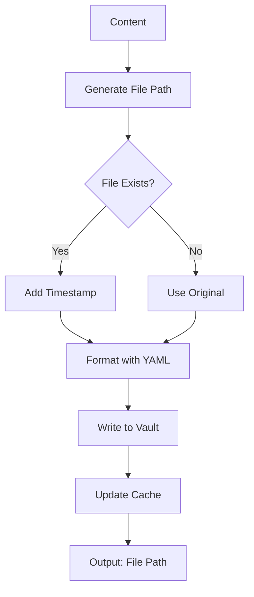

## AI Service Architecture

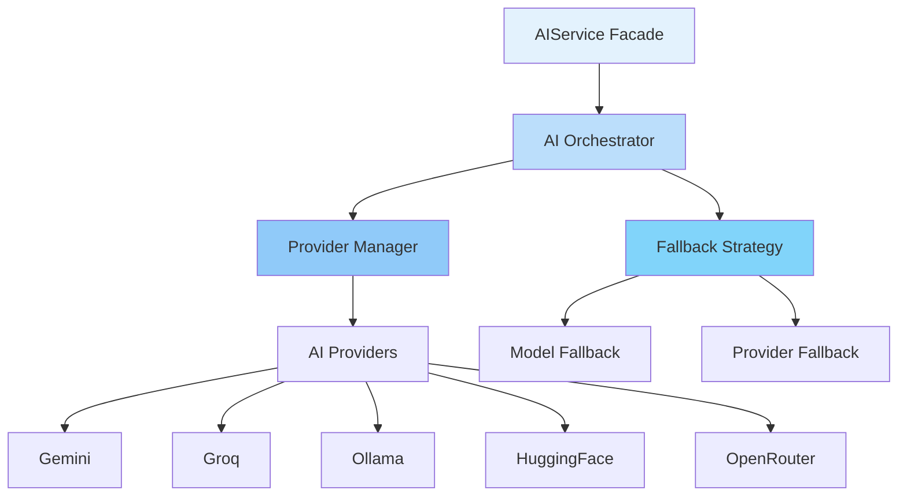

## Component Architecture

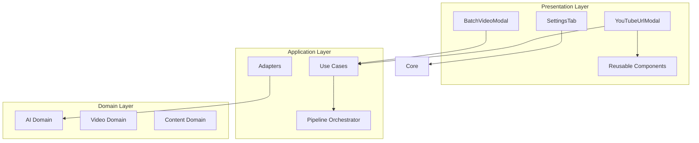

## Data Flow Diagram

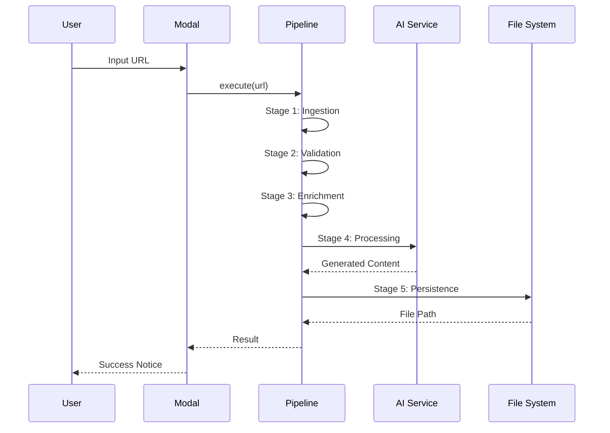

## Directory Structure

```
src/
├── core/                          # Core plugin management
│   ├── lifecycle.ts               # Load/unload handling
│   └── registry.ts                # UI registration
│
├── domain/                        # Business logic
│   ├── ai/                        # AI domain
│   │   ├── ai-orchestrator.ts     # Main AI orchestration
│   │   ├── provider-manager.ts    # Provider management
│   │   └── fallback-strategy.ts   # Fallback logic
│   ├── video/                     # Video domain
│   └── content/                   # Content domain
│
├── infrastructure/                # External services
│   ├── persistence/               # Data persistence
│   ├── http/                      # HTTP client
│   └── observability/             # Logging & metrics
│
├── presentation/                  # UI layer
│   ├── modals/                    # Modal components
│   ├── settings/                  # Settings UI
│   └── components/                # Reusable UI components
│       ├── url-input.component.ts
│       └── progress-indicator.component.ts
│
├── application/                   # Application services
│   ├── pipeline/                  # 5-stage pipeline
│   │   ├── orchestrator.ts
│   │   ├── stages/
│   │   └── middleware.ts
│   ├── adapters/                  # Compatibility adapters
│   └── use-cases/                 # Business use cases
│
└── shared/                        # Shared utilities
    ├── types/                     # Type definitions
    ├── utils/                     # Utilities
    └── constants/                 # Constants
```

## Deployment Architecture

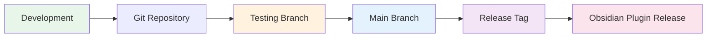

## Performance Optimization Architecture

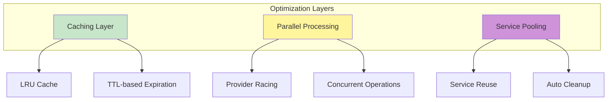

## Error Handling Architecture

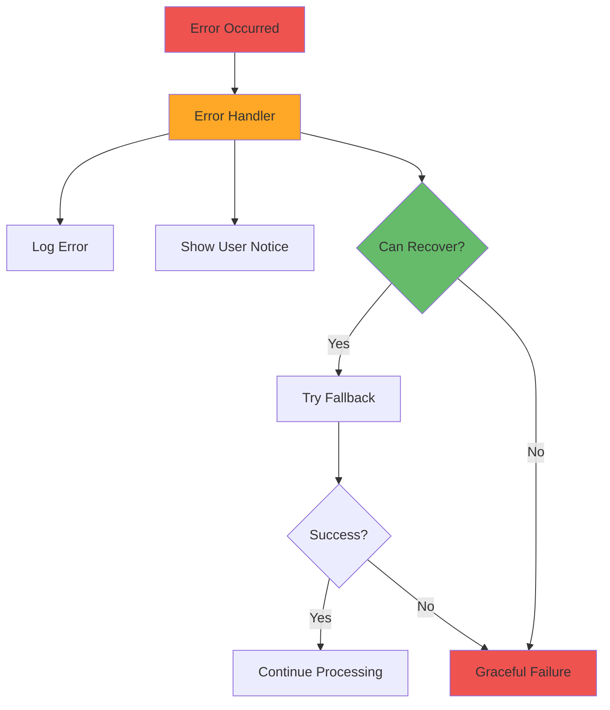

## Testing Architecture

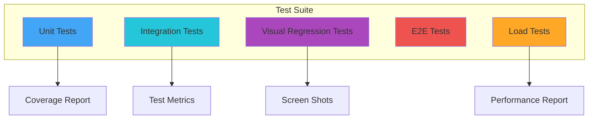

## Migration Path

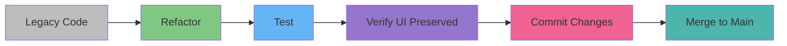
